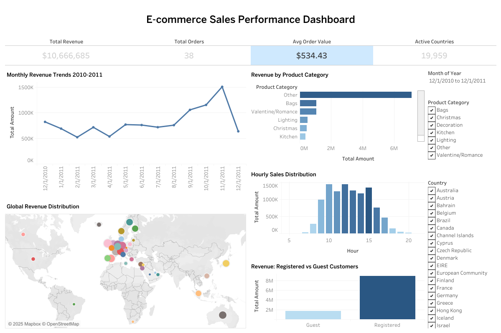

# Global E-commerce Sales Analysis

## Project Overview
A comprehensive analysis of global e-commerce sales data to identify performance patterns, customer segments, and revenue optimization opportunities. This project analyzes over 530,000 transactions from 38 countries spanning December 2010 to December 2011.

## Business Objectives
- Identify top-performing markets and revenue drivers
- Analyze seasonal trends and sales patterns
- Segment customers and products for targeted strategies
- Create interactive dashboard for ongoing performance monitoring

## Technologies Used
- **SQL (SQLite + DBeaver)**: Data storage and complex analytical queries
- **Python**: Data cleaning, preprocessing, and exploratory analysis
- **Tableau**: Interactive dashboard creation and data visualization
- **Pandas & NumPy**: Data manipulation and statistical analysis

## Key Findings
- **Market Concentration**: UK dominates with 85% of total revenue ($9.02M out of $10.67M)
- **Seasonal Patterns**: Strong Q4 performance with November peak ($1.51M)
- **Customer Segmentation**: Registered customers generate 3x more revenue than guest users
- **Peak Operations**: Thursday at 10 AM shows highest sales activity
- **Product Performance**: Valentine/Romance category leads with strong lighting products

## Dataset Information
- **Source**: Kaggle E-commerce Dataset
- **Records**: 530,104 transactions (after cleaning)
- **Time Period**: December 2010 - December 2011
- **Geographic Coverage**: 38 countries
- **Product Range**: 3,922 unique products

## Technical Implementation

### Data Processing Pipeline
1. **Raw Data Import**: 541,909 initial records
2. **Data Cleaning**: Removed returns, invalid prices, missing descriptions
3. **Feature Engineering**: Added time-based features and customer segmentation
4. **Database Creation**: SQLite database with optimized query structure

### Analysis Components
- Country-level performance metrics
- Time-series trend analysis
- Product categorization and ranking
- Customer lifetime value calculations
- Hourly and daily sales patterns

### Dashboard Features
- Interactive world map with revenue distribution
- Monthly trend analysis with forecasting
- Product category performance comparison
- Hourly sales distribution patterns
- Customer type revenue analysis

### Access the Interactive Dashboard
Explore the full interactive dashboard here:  

[Global E-commerce Sales Dashboard](https://public.tableau.com/app/profile/aldenia.alexandra/viz/ecommerce_dashboard_17547999474770/Dashboard1)


## Project Structure
```
global-ecommerce-sales-analysis/
├── data/
│   ├── ecommerce_data.csv          # Raw dataset
│   ├── ecommerce_cleaned.csv       # Processed data
│   └── ecommerce_analysis.db       # SQLite database
├── output/
│   ├── top_countries_revenue.csv   # Top 10 countries by revenue
│   ├── monthly_revenue_trends.csv  # Monthly sales trends
│   ├── top_products_revenue.csv    # Top 20 products analysis
│   ├── customer_analysis.csv       # Customer segmentation metrics
│   ├── tableau_main_dataset.csv    # Tableau data source
│   ├── tableau_country_summary.csv # Country performance metrics
│   ├── tableau_time_series.csv     # Time-based analysis data
│   ├── tableau_data_dictionary.txt # Data field descriptions
│   ├── sql_queries.sql             # SQL analysis queries
│   ├── ecommerce_dashboard.twbx    # Tableau workbook
│   └── ecommerce_dashboard.png     # Tableau dashboard screenshot
├── project.ipynb                   # Main analysis notebook
├── requirements.txt                # Python dependencies
└── README.md                      # Project documentation
```

## Business Recommendations
1. **Market Expansion**: Leverage UK success model in Netherlands and Germany
2. **Inventory Planning**: Prepare for Q4 seasonal surge (September-November)
3. **Customer Retention**: Implement registration incentives for guest users
4. **Product Strategy**: Focus on Valentine/Romance and Lighting categories
5. **Operational Optimization**: Staff peak hours (10 AM) and Thursday operations

## Future Enhancements
- Customer churn prediction modeling
- Price elasticity analysis
- Inventory forecasting algorithms
- Real-time dashboard integration
- Advanced customer segmentation with RFM analysis

## Contact
Aldenia Alexandra | aldnalexandr@gmail.com | [LinkedIn Profile](https://www.linkedin.com/in/aldeniaalexandra/) | [GitHub Repository](https://github.com/aldeniaalexandra)